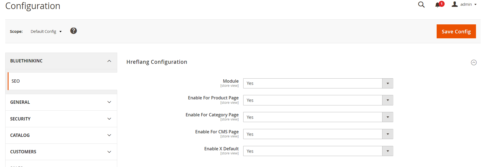

# Module Bluethinkinc Seo

    ``bluethinkinc/module-seo``

 - [Main Functionalities](#markdown-header-main-functionalities)
 - [Installation](#markdown-header-installation)
 - [Configuration](#markdown-header-configuration)
 - [Specifications](#markdown-header-specifications)
 - [Attributes](#markdown-header-attributes)

## Main Functionalities
This module is used for adding hreflang seo to website pages.

## Installation
\* = in production please use the `--keep-generated` option

### Type 1: Zip file

 - Unzip the zip file in `app/code/Bluethinkinc`
 - Enable the module by running `php bin/magento module:enable Bluethinkinc_Seo`
 - Apply database updates by running `php bin/magento setup:upgrade`\*
 - Compilation by running `php bin/magento setup:di:compile`
 - Static Content deploy by running `php bin/magento setup:static-content:deploy`
 - Flush the cache by running `php bin/magento cache:flush`

### Type 2: Composer

 - Make the module available in a composer repository for example:
    - private repository `repo.magento.com`
    - public repository `packagist.org`
    - public github repository as vcs
 - Add the composer repository to the configuration by running `composer config repositories.repo.magento.com composer https://repo.magento.com/`
 - Install the module composer by running `composer require bluethinkinc/module-seo`
 - enable the module by running `php bin/magento module:enable Bluethinkinc_Seo`
 - apply database updates by running `php bin/magento setup:upgrade`\*
 - compilation by running `php bin/magento setup:di:compile`
 - static Content deploy by running `php bin/magento setup:static-content:deploy`
 - flush the cache by running `php bin/magento cache:flush`

## Configuration

 - Module (seo/hreflang_config/enable)

 - Enbale For Product Page (seo/hreflang_config/enable_product_page)

 - Enable For Category Page (seo/hreflang_config/enable_categoery_page)

 - Enable For Category Page (seo/hreflang_config/enable_cms_page)

 - Enable X Default (seo/hreflang_config/enable_x_default)
